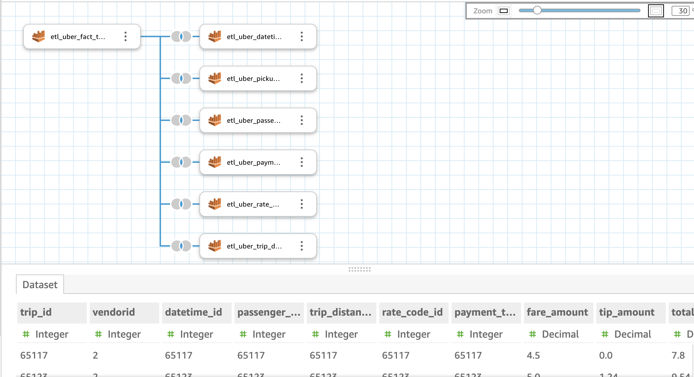
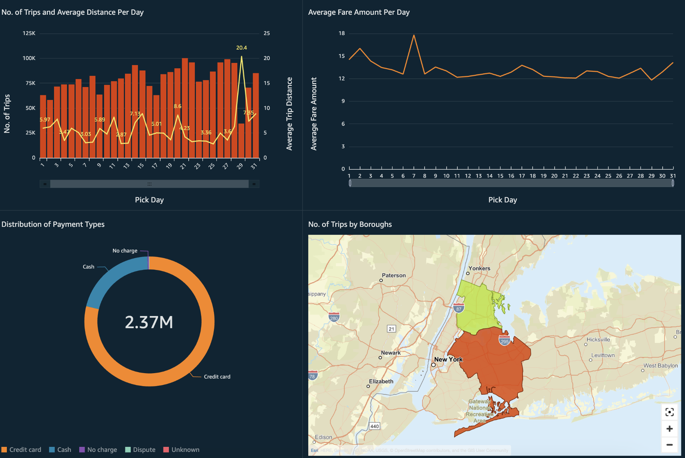

# Uber Data Analytics Project Introduction:

The goal of this project is to perform data analytics on Uber data using various tools like AWS Glue, Athena, S3 buckets, PySpark and develop a dashboard on AWS Quicksight.
 
# Code and Resources used:

* **Python version:** 3.8.8
* **Packages:** Pandas, Numpy, Matplotlib, PySpark
* **AWS Tools:** Glue, Athena, S3, Quicksight
* **Video tutorial:** https://www.youtube.com/watch?v=WpQECq5Hx9g

# Dataset used:

* We used TLC Trip Record Data for Yellow Taxis for January 2022.
* Link: https://www.nyc.gov/site/tlc/about/tlc-trip-record-data.page

# Steps followed:

1. In AWS, created an S3 bucket and uploaded our data.
2. Created a role in IAM to access AWS Glue.
3. Configured a database in AWS Glue.
4. Ran a Crawler to create a Table for our dataset in Glue.
5. Developed a Jupyter Notebook to process the dataset in PySpark:
    1. Spark set-up and reading data
    2. Data Cleaning and Transformation
    3. Data Modeling
    4. Writing the data to Glue data catalog and S3 bucket
6. Ran exploratory queries on Athena. The following queries were executed:
   1. No. of trips per day in January
    ```
    select count(*) as no_of_trips, pick_day from etl_uber_datetime_dim
    group by pick_day;
    ``` 
    2. No. of trips per weekday in January <br>
    ```
    select count(*) as no_of_trips, pick_weekday from etl_uber_datetime_dim
    group by pick_weekday
    order by pick_weekday;
    ```
    3. Distribution of payment types
    ```
    select count(*) as no_of_trips, pick_day from etl_uber_datetime_dim
    group by pick_day;
    ```
    4. Average fare amount per month
    ```
    select avg(fare_amount) as average_fare_amount, pick_weekday
    from etl_uber_fact__table a JOIN etl_uber_datetime_dim b
    ON a.datetime_id = b.datetime_id
    GROUP BY b.pick_weekday
    order by b.pick_weekday;
    ```
7. Visualized the data in AWS QuickSight

# Dashboard:

1. Data preparation for dashboard:




2. Visualization



